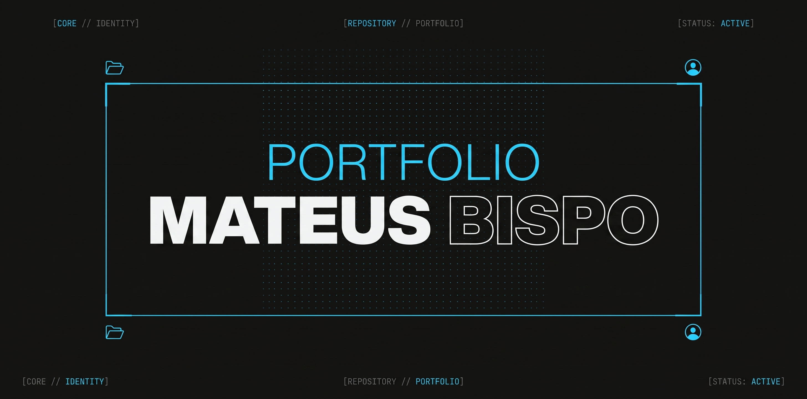

<h1 align="center"> Mateus José Bispo Oliveira </h1>

<p align="center">
Portfólio pessoal desenvolvido para apresentar minha formação, habilidades, projetos e experiências na área de Tecnologia da Informação.
</p>

<p align="center">
  <a href="#-projeto">Projeto</a>&nbsp;&nbsp;&nbsp;|&nbsp;&nbsp;&nbsp;
  <a href="#-tecnologias">Tecnologias</a>&nbsp;&nbsp;&nbsp;|&nbsp;&nbsp;&nbsp;
  <a href="#️-funcionalidades">Funcionalidades</a>&nbsp;&nbsp;&nbsp;|&nbsp;&nbsp;&nbsp;
  <a href="#-estrutura-do-projeto">Estrutura do Projeto</a>&nbsp;&nbsp;&nbsp;|&nbsp;&nbsp;&nbsp;
  <a href="#-licença">Licença</a>
</p>

<p align="center">
  
</p>

<br>

<p align="center">
  
</p>

## 💻 Projeto

Este projeto é meu portfólio pessoal, desenvolvido para centralizar informações sobre minha trajetória acadêmica, conhecimentos técnicos, projetos e experiências extracurriculares.

O site apresenta uma identidade visual moderna e tecnológica, utilizando uma interface minimalista com elementos inspirados em sistemas e interfaces digitais.

Além das informações sobre minha formação e projetos, o portfólio possui uma página dedicada a um jogo da forca desenvolvido em React.

## 🚀 Tecnologias

Este projeto foi desenvolvido utilizando as seguintes tecnologias:

- Next.js
- React
- JavaScript
- HTML5
- CSS3
- Git e GitHub
- Visual Studio Code

## 🛠️ Funcionalidades

- Apresentação pessoal
- Formação acadêmica
- Experiências extracurriculares
- Habilidades e tecnologias
- Apresentação de projetos
- Área de contato
- Jogo da Forca 

## 📂 Estrutura do Projeto

```text
portfolio/
├── app/
│   ├── projetos/
│   │   └── forca/
│   │       └── page.js
│   ├── globals.css
│   ├── layout.js
│   └── page.js
├── public/
│   └── profile.png
│   └── capa.png
├── package.json
├── package-lock.json
└── README.md
```

## 📝 Licença

Esse projeto está sob a licença MIT.